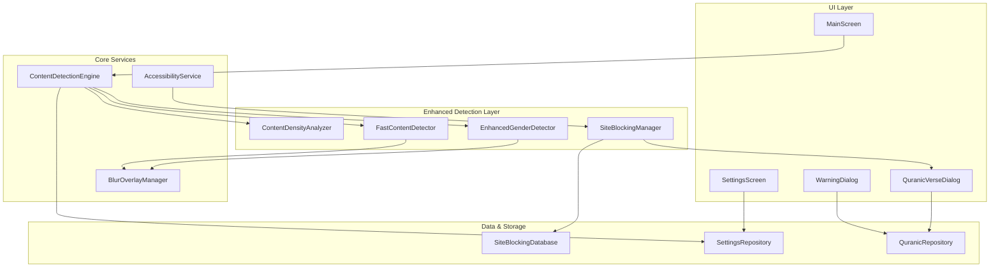

# Design Document

## Overview

This design modernizes HaramBlur's content detection system with enhanced gender detection algorithms, ultra-fast blur processing, improved accuracy for inappropriate content detection, full-screen warnings with mandatory reflection periods, and built-in Islamic-guided porn site blocking. The solution maintains the existing MVVM architecture while introducing new specialized components for advanced detection, site blocking, and Islamic guidance features.

## Architecture

### High-Level Architecture



### Component Integration

The enhanced system integrates with existing components:
- **ContentDetectionEngine**: Enhanced with new detection algorithms
- **BlurOverlayManager**: Extended with full-screen warning capabilities
- **MLModelManager**: Upgraded with faster inference and gender-specific models
- **AccessibilityService**: Enhanced with site blocking and URL monitoring

## Components and Interfaces

### 1. Enhanced Gender Detection

#### EnhancedGenderDetector
```kotlin
interface EnhancedGenderDetector {
    suspend fun detectGender(face: Face, bitmap: Bitmap): GenderDetectionResult
    suspend fun analyzeGenderDistribution(faces: List<Face>, bitmap: Bitmap): GenderDistributionResult
    fun updateGenderModel(modelPath: String): Boolean
}

data class GenderDetectionResult(
    val gender: Gender,
    val confidence: Float,
    val facialFeatures: FacialFeatureAnalysis,
    val processingTimeMs: Long
)

data class GenderDistributionResult(
    val maleCount: Int,
    val femaleCount: Int,
    val unknownCount: Int,
    val averageConfidence: Float,
    val recommendedAction: BlurAction
)
```

**Implementation Strategy:**
- Integrate TensorFlow Lite gender classification model (MobileNetV3-based)
- Use facial landmark detection for improved accuracy
- Implement confidence thresholding with fallback to safer defaults
- Cache gender predictions for faces across frames to improve performance

### 2. Fast Content Detection

#### FastContentDetector
```kotlin
interface FastContentDetector {
    suspend fun detectContentFast(bitmap: Bitmap, settings: DetectionSettings): FastDetectionResult
    suspend fun analyzeContentDensity(bitmap: Bitmap): ContentDensityResult
    fun setPerformanceMode(mode: PerformanceMode)
}

data class FastDetectionResult(
    val shouldBlur: Boolean,
    val blurRegions: List<Rect>,
    val contentType: ContentType,
    val processingTimeMs: Long,
    val confidenceScore: Float
)

data class ContentDensityResult(
    val inappropriateContentPercentage: Float,
    val distributionMap: Array<Array<Float>>,
    val recommendsFullScreenBlur: Boolean,
    val criticalRegions: List<Rect>
)
```

**Performance Optimizations:**
- Multi-threaded processing with coroutines
- Image downscaling for initial detection (224x224 → 112x112 for ultra-fast mode)
- Region-of-interest (ROI) based processing
- Frame skipping during rapid scrolling
- GPU acceleration using TensorFlow Lite GPU delegate

### 3. Site Blocking Manager

#### SiteBlockingManager
```kotlin
interface SiteBlockingManager {
    suspend fun checkUrl(url: String): SiteBlockingResult
    suspend fun getQuranicVerse(category: BlockingCategory): QuranicVerse
    fun updateBlockingDatabase(): Boolean
    fun reportFalsePositive(url: String, reason: String)
}

data class SiteBlockingResult(
    val isBlocked: Boolean,
    val category: BlockingCategory,
    val confidence: Float,
    val quranicVerse: QuranicVerse?,
    val reflectionTimeSeconds: Int
)

enum class BlockingCategory {
    EXPLICIT_CONTENT,
    ADULT_ENTERTAINMENT,
    INAPPROPRIATE_IMAGERY,
    GAMBLING,
    SUSPICIOUS_CONTENT
}
```

**Blocking Database Structure:**
- Local SQLite database with hashed domain patterns
- Regex patterns for dynamic URL matching
- Category-based blocking with Islamic guidance
- Offline-first approach with periodic updates

### 4. Content Density Analyzer

#### ContentDensityAnalyzer
```kotlin
interface ContentDensityAnalyzer {
    suspend fun analyzeScreenContent(bitmap: Bitmap): DensityAnalysisResult
    fun calculateBlurCoverage(regions: List<Rect>, screenSize: Size): Float
    fun shouldTriggerFullScreenWarning(density: Float, settings: AppSettings): Boolean
}

data class DensityAnalysisResult(
    val inappropriateContentDensity: Float,
    val spatialDistribution: SpatialDistribution,
    val recommendedAction: ContentAction,
    val warningLevel: WarningLevel
)

enum class ContentAction {
    NO_ACTION,
    SELECTIVE_BLUR,
    FULL_SCREEN_BLUR,
    BLOCK_AND_WARN,
    IMMEDIATE_CLOSE
}
```

## Data Models

### Enhanced Settings Model

```kotlin
data class EnhancedAppSettings(
    // Existing settings
    val enableFaceDetection: Boolean = true,
    val enableNSFWDetection: Boolean = true,
    val blurMaleFaces: Boolean = true,
    val blurFemaleFaces: Boolean = true,
    val detectionSensitivity: Float = 0.5f,
    val blurIntensity: BlurIntensity = BlurIntensity.MEDIUM,
    val processingSpeed: ProcessingSpeed = ProcessingSpeed.BALANCED,
    
    // New enhanced settings
    val genderDetectionAccuracy: GenderAccuracy = GenderAccuracy.HIGH,
    val contentDensityThreshold: Float = 0.4f, // 40% threshold for full-screen blur
    val mandatoryReflectionTime: Int = 15, // seconds
    val enableSiteBlocking: Boolean = true,
    val enableQuranicGuidance: Boolean = true,
    val ultraFastModeEnabled: Boolean = false,
    val fullScreenWarningEnabled: Boolean = true,
    
    // Performance settings
    val maxProcessingTimeMs: Long = 50L,
    val enableGPUAcceleration: Boolean = true,
    val frameSkipThreshold: Int = 3,
    
    // Islamic guidance settings
    val preferredLanguage: Language = Language.ENGLISH,
    val verseDisplayDuration: Int = 10, // seconds
    val enableArabicText: Boolean = true
)

enum class GenderAccuracy {
    FAST(0.75f, "Fast detection, 75% accuracy"),
    BALANCED(0.85f, "Balanced speed and accuracy"),
    HIGH(0.92f, "High accuracy, slower processing")
}

enum class Language {
    ENGLISH, ARABIC, URDU, FRENCH, INDONESIAN
}
```

### Quranic Content Model

```kotlin
data class QuranicVerse(
    val id: String,
    val surahName: String,
    val surahNumber: Int,
    val verseNumber: Int,
    val arabicText: String,
    val transliteration: String,
    val translations: Map<Language, String>,
    val category: BlockingCategory,
    val context: String,
    val reflection: String
)

data class IslamicGuidance(
    val verse: QuranicVerse,
    val guidance: String,
    val actionRecommendations: List<String>,
    val duaText: String?
)
```

### Site Blocking Database Schema

```sql
CREATE TABLE blocked_sites (
    id INTEGER PRIMARY KEY,
    domain_hash TEXT UNIQUE,
    pattern TEXT,
    category TEXT,
    confidence REAL,
    last_updated INTEGER,
    is_regex BOOLEAN DEFAULT 0
);

CREATE TABLE quranic_verses (
    id TEXT PRIMARY KEY,
    surah_name TEXT,
    surah_number INTEGER,
    verse_number INTEGER,
    arabic_text TEXT,
    transliteration TEXT,
    english_translation TEXT,
    arabic_translation TEXT,
    urdu_translation TEXT,
    category TEXT,
    context TEXT,
    reflection TEXT
);

CREATE TABLE false_positives (
    id INTEGER PRIMARY KEY,
    url_hash TEXT,
    reported_at INTEGER,
    reason TEXT,
    status TEXT DEFAULT 'pending'
);
```

## Error Handling

### Detection Error Recovery

```kotlin
sealed class DetectionError {
    object ModelNotLoaded : DetectionError()
    object ProcessingTimeout : DetectionError()
    object InsufficientMemory : DetectionError()
    data class NetworkError(val message: String) : DetectionError()
    data class UnknownError(val throwable: Throwable) : DetectionError()
}

class ErrorRecoveryManager {
    suspend fun handleDetectionError(error: DetectionError): RecoveryAction {
        return when (error) {
            is DetectionError.ModelNotLoaded -> RecoveryAction.FallbackToHeuristics
            is DetectionError.ProcessingTimeout -> RecoveryAction.ReduceQuality
            is DetectionError.InsufficientMemory -> RecoveryAction.ClearCache
            is DetectionError.NetworkError -> RecoveryAction.UseOfflineMode
            is DetectionError.UnknownError -> RecoveryAction.RestartService
        }
    }
}
```

### Graceful Degradation Strategy

1. **Model Loading Failure**: Fall back to heuristic-based detection
2. **Performance Issues**: Automatically reduce detection frequency
3. **Memory Constraints**: Clear caches and reduce image resolution
4. **Site Blocking Database Issues**: Use embedded fallback list
5. **Quranic Content Loading**: Display default guidance text

## Testing Strategy

### Unit Testing

```kotlin
class EnhancedGenderDetectorTest {
    @Test
    fun `should detect male faces with high confidence`()
    
    @Test
    fun `should exclude males when male blur disabled`()
    
    @Test
    fun `should handle low confidence gracefully`()
    
    @Test
    fun `should process within performance threshold`()
}

class FastContentDetectorTest {
    @Test
    fun `should complete detection within 50ms in ultra fast mode`()
    
    @Test
    fun `should trigger full screen blur for high density content`()
    
    @Test
    fun `should maintain accuracy above 85% threshold`()
}

class SiteBlockingManagerTest {
    @Test
    fun `should block known pornographic sites`()
    
    @Test
    fun `should display appropriate quranic verse`()
    
    @Test
    fun `should handle false positives correctly`()
}
```

### Integration Testing

```kotlin
class ContentDetectionIntegrationTest {
    @Test
    fun `should integrate enhanced detection with existing blur overlay`()
    
    @Test
    fun `should maintain performance under load`()
    
    @Test
    fun `should handle concurrent detection requests`()
}
```

### Performance Testing

- **Latency Testing**: Ensure <50ms processing time in ultra-fast mode
- **Memory Testing**: Monitor memory usage under continuous operation
- **Battery Testing**: Measure battery impact with enhanced algorithms
- **Accuracy Testing**: Validate gender detection accuracy >90%
- **Load Testing**: Test with multiple simultaneous detection requests

### Islamic Content Validation

- **Verse Accuracy**: Validate all Quranic verses with Islamic scholars
- **Translation Quality**: Ensure accurate translations in supported languages
- **Cultural Sensitivity**: Review guidance text for cultural appropriateness
- **Theological Correctness**: Verify Islamic guidance aligns with mainstream teachings

## Implementation Phases

### Phase 1: Enhanced Gender Detection (Week 1-2)
- Implement EnhancedGenderDetector with TensorFlow Lite model
- Integrate with existing FaceDetectionManager
- Add gender-specific settings and confidence thresholds
- Unit testing and accuracy validation

### Phase 2: Ultra-Fast Processing (Week 2-3)
- Implement FastContentDetector with performance optimizations
- Add GPU acceleration and multi-threading
- Implement frame skipping and ROI processing
- Performance testing and optimization

### Phase 3: Content Density Analysis (Week 3-4)
- Implement ContentDensityAnalyzer
- Add full-screen blur triggering logic
- Integrate with BlurOverlayManager for warning dialogs
- Testing with various content types

### Phase 4: Site Blocking System (Week 4-5)
- Implement SiteBlockingManager and database
- Create Quranic content repository
- Add URL monitoring to AccessibilityService
- Islamic content validation and testing

### Phase 5: Integration and Polish (Week 5-6)
- Integrate all components with existing architecture
- Add enhanced settings UI
- Comprehensive testing and bug fixes
- Performance optimization and final validation