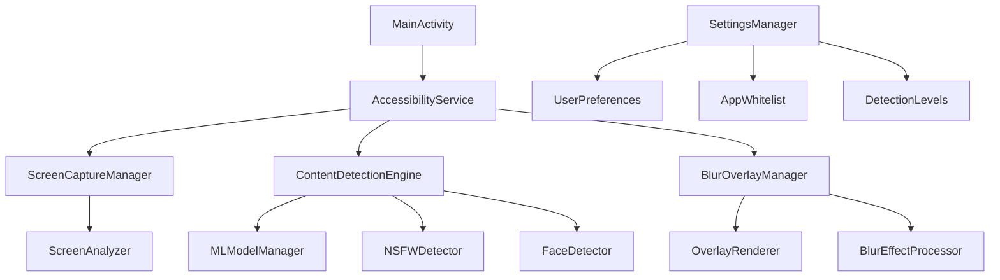

# HaramBlur Android - Comprehensive Development Plan


## 📋 Project Overview

**HaramBlur Android** is an accessibility service app that automatically detects and blurs inappropriate content across all Android applications. Inspired by the successful HaramBlur browser extension, this mobile implementation provides real-time content filtering while maintaining optimal performance on older devices.

### Core Objectives
- ✅ **Privacy First**: 100% local processing, zero data transmission
- ✅ **Performance Optimized**: Smooth operation on devices with 2GB+ RAM
- ✅ **Islamic Values**: Respectful content filtering aligned with Islamic principles
- ✅ **User Control**: Granular settings and customization options
- ✅ **Accessibility**: Full compliance with Android accessibility guidelines

---

## 🏗️ Technical Architecture

### System Components



### Technology Stack

| Component | Technology | Purpose |
|-----------|------------|---------|
| **Language** | Kotlin | Primary development language |
| **ML Framework** | TensorFlow Lite | Content detection models |
| **Image Processing** | OpenCV Android | Blur effects and image manipulation |
| **Architecture** | MVVM + Repository | Clean architecture pattern |
| **Database** | Room + SQLite | Local data storage |
| **Preferences** | SharedPreferences | User settings |
| **ML Kit** | Google ML Kit | Face detection |
| **Threading** | Coroutines | Async processing |

---

## 📅 Development Phases

## Phase 1: Foundation & Infrastructure (Weeks 1-2)

### Week 1: Core Setup
**🎯 Goal**: Establish project foundation and accessibility service structure

#### Task 1.1: Project Structure Setup
- [ ] **T1.1.1**: Update `build.gradle.kts` with required dependencies
  - TensorFlow Lite Android
  - OpenCV Android SDK
  - Room database
  - ML Kit
  - Coroutines
- [ ] **T1.1.2**: Create modular package structure
  ```
  com.hieltech.haramblur/
  ├── accessibility/          # Accessibility service core
  ├── detection/             # Content detection logic  
  ├── ui/                    # User interface components
  ├── data/                  # Database and repositories
  ├── utils/                 # Utility classes
  └── ml/                    # ML model management
  ```
- [ ] **T1.1.3**: Set up dependency injection with Hilt
- [ ] **T1.1.4**: Configure ProGuard rules for ML models

#### Task 1.2: Accessibility Service Foundation
- [ ] **T1.2.1**: Create `HaramBlurAccessibilityService` class
- [ ] **T1.2.2**: Add accessibility service manifest configuration
- [ ] **T1.2.3**: Implement basic service lifecycle methods
- [ ] **T1.2.4**: Add permission handling for accessibility service
- [ ] **T1.2.5**: Create service connection status monitoring

### Week 2: Screen Capture & Overlay System
**🎯 Goal**: Implement screen monitoring and overlay rendering

#### Task 1.3: Screen Capture Implementation
- [ ] **T1.3.1**: Implement `ScreenCaptureManager` class
- [ ] **T1.3.2**: Add screen recording permission handling
- [ ] **T1.3.3**: Create efficient bitmap capture system
- [ ] **T1.3.4**: Implement screen change detection
- [ ] **T1.3.5**: Add capture rate throttling for performance

#### Task 1.4: Overlay Window System
- [ ] **T1.4.1**: Create `BlurOverlayManager` class
- [ ] **T1.4.2**: Implement `TYPE_ACCESSIBILITY_OVERLAY` window
- [ ] **T1.4.3**: Add touch-through for non-blurred areas
- [ ] **T1.4.4**: Create overlay positioning system
- [ ] **T1.4.5**: Implement basic blur effect rendering

**📊 Phase 1 Success Criteria:**
- Accessibility service successfully captures screen
- Overlay window displays over other apps
- Basic blur effect can be applied to screen regions
- Service runs without crashes for 30+ minutes

---

## Phase 2: Content Detection Engine (Weeks 3-4)

### Week 3: ML Model Integration
**🎯 Goal**: Implement core content detection capabilities

#### Task 2.1: TensorFlow Lite Setup
- [ ] **T2.1.1**: Download and optimize NSFW detection models
- [ ] **T2.1.2**: Create `MLModelManager` class
- [ ] **T2.1.3**: Implement model loading and caching
- [ ] **T2.1.4**: Add model inference pipeline
- [ ] **T2.1.5**: Create model quantization for older devices

#### Task 2.2: Content Detection Pipeline
- [ ] **T2.2.1**: Implement `ContentDetectionEngine` class
- [ ] **T2.2.2**: Create `NSFWDetector` with confidence scoring
- [ ] **T2.2.3**: Add `FaceDetector` using ML Kit
- [ ] **T2.2.4**: Implement region-based analysis
- [ ] **T2.2.5**: Create detection result caching system

### Week 4: Detection Optimization
**🎯 Goal**: Optimize detection performance and accuracy

#### Task 2.3: Performance Optimization
- [ ] **T2.3.1**: Implement multi-threaded detection processing
- [ ] **T2.3.2**: Add detection scheduling based on screen activity
- [ ] **T2.3.3**: Create adaptive resolution scaling
- [ ] **T2.3.4**: Implement smart region cropping
- [ ] **T2.3.5**: Add detection confidence thresholds

#### Task 2.4: Detection Accuracy
- [ ] **T2.4.1**: Implement ensemble detection (multiple models)
- [ ] **T2.4.2**: Add temporal consistency (frame-to-frame)
- [ ] **T2.4.3**: Create false positive reduction algorithms
- [ ] **T2.4.4**: Implement content type classification
- [ ] **T2.4.5**: Add user feedback learning system

**📊 Phase 2 Success Criteria:**
- NSFW detection accuracy >90% on test dataset
- Detection latency <200ms on mid-range devices
- False positive rate <5% on normal content
- Memory usage stays under 100MB during detection

---

## Phase 3: Performance & Optimization (Weeks 5-6)

### Week 5: Resource Management
**🎯 Goal**: Optimize for older devices and battery life

#### Task 3.1: Memory Optimization
- [ ] **T3.1.1**: Implement bitmap recycling and pooling
- [ ] **T3.1.2**: Add memory pressure monitoring
- [ ] **T3.1.3**: Create adaptive quality settings
- [ ] **T3.1.4**: Implement garbage collection optimization
- [ ] **T3.1.5**: Add memory leak detection and prevention

#### Task 3.2: CPU & Battery Optimization
- [ ] **T3.2.1**: Implement frame rate adaptive throttling
- [ ] **T3.2.2**: Add background processing limitations
- [ ] **T3.2.3**: Create device performance profiling
- [ ] **T3.2.4**: Implement sleep mode detection
- [ ] **T3.2.5**: Add battery level monitoring

### Week 6: Rendering Optimization
**🎯 Goal**: Smooth blur effects and overlay performance

#### Task 3.3: Blur Effect Optimization
- [ ] **T3.3.1**: Implement GPU-accelerated blur using RenderScript
- [ ] **T3.3.2**: Add blur intensity adaptive scaling
- [ ] **T3.3.3**: Create multi-level blur caching
- [ ] **T3.3.4**: Implement blur boundary smoothing
- [ ] **T3.3.5**: Add blur animation transitions

#### Task 3.4: Overlay Performance
- [ ] **T3.4.1**: Optimize overlay redraw cycles
- [ ] **T3.4.2**: Implement dirty region tracking
- [ ] **T3.4.3**: Add overlay layer compositing
- [ ] **T3.4.4**: Create touch event optimization
- [ ] **T3.4.5**: Implement overlay fade effects

**📊 Phase 3 Success Criteria:**
- App runs smoothly on devices with 2GB RAM
- Battery drain <3% per hour of active use
- Blur rendering at 30+ FPS on mid-range devices
- CPU usage <10% during idle periods

---

## Phase 4: User Interface & Settings (Weeks 7-8)

### Week 7: Main UI Implementation
**🎯 Goal**: Create intuitive user interface

#### Task 4.1: MainActivity & Navigation
- [ ] **T4.1.1**: Design Material 3 UI layouts
- [ ] **T4.1.2**: Implement navigation with Jetpack Compose
- [ ] **T4.1.3**: Create onboarding flow for new users
- [ ] **T4.1.4**: Add accessibility service setup wizard
- [ ] **T4.1.5**: Implement service status monitoring UI

#### Task 4.2: Settings Interface
- [ ] **T4.2.1**: Create detection sensitivity sliders
- [ ] **T4.2.2**: Add blur intensity controls
- [ ] **T4.2.3**: Implement app whitelist management
- [ ] **T4.2.4**: Add quick toggle notifications
- [ ] **T4.2.5**: Create detection statistics dashboard

### Week 8: Advanced Settings
**🎯 Goal**: Comprehensive user customization options

#### Task 4.3: Advanced Configuration
- [ ] **T4.3.1**: Implement per-app detection settings
- [ ] **T4.3.2**: Add time-based filtering (prayer times, etc.)
- [ ] **T4.3.3**: Create detection category toggles
- [ ] **T4.3.4**: Add emergency disable features
- [ ] **T4.3.5**: Implement backup/restore settings

#### Task 4.4: User Experience
- [ ] **T4.4.1**: Add tutorial and help system
- [ ] **T4.4.2**: Create feedback and rating system
- [ ] **T4.4.3**: Implement dark/light theme support
- [ ] **T4.4.4**: Add accessibility features (TalkBack support)
- [ ] **T4.4.5**: Create multi-language support (Arabic, English)

**📊 Phase 4 Success Criteria:**
- Intuitive UI that requires no training
- Complete accessibility service setup in <2 minutes
- Settings changes apply immediately
- App supports RTL languages properly

---

## Phase 5: Security & Privacy (Weeks 9-10)

### Week 9: Data Protection
**🎯 Goal**: Implement comprehensive privacy protection

#### Task 5.1: Local Processing Security
- [ ] **T5.1.1**: Ensure zero network communication
- [ ] **T5.1.2**: Implement secure model storage
- [ ] **T5.1.3**: Add data encryption for sensitive settings
- [ ] **T5.1.4**: Create secure memory handling
- [ ] **T5.1.5**: Implement screenshot prevention for sensitive screens

#### Task 5.2: User Privacy
- [ ] **T5.2.1**: Create privacy policy and consent flows
- [ ] **T5.2.2**: Add data usage transparency
- [ ] **T5.2.3**: Implement usage analytics (local only)
- [ ] **T5.2.4**: Create data deletion mechanisms
- [ ] **T5.2.5**: Add privacy audit logging

### Week 10: Security Hardening
**🎯 Goal**: Secure the application against potential threats

#### Task 5.3: Application Security
- [ ] **T5.3.1**: Implement certificate pinning (if any network requests)
- [ ] **T5.3.2**: Add tamper detection mechanisms
- [ ] **T5.3.3**: Create secure key storage
- [ ] **T5.3.4**: Implement anti-reverse engineering measures
- [ ] **T5.3.5**: Add integrity verification for ML models

#### Task 5.4: Compliance & Audit
- [ ] **T5.4.1**: GDPR compliance verification
- [ ] **T5.4.2**: Android security best practices audit
- [ ] **T5.4.3**: Accessibility compliance testing
- [ ] **T5.4.4**: Privacy impact assessment
- [ ] **T5.4.5**: Security penetration testing

**📊 Phase 5 Success Criteria:**
- Zero data transmission to external servers
- All sensitive data encrypted at rest
- App passes security audit
- Privacy policy clearly explains data handling

---

## 🔧 Technical Requirements

### Dependencies & Libraries

```kotlin
// app/build.gradle.kts dependencies
dependencies {
    // Core Android
    implementation("androidx.core:core-ktx:1.12.0")
    implementation("androidx.appcompat:appcompat:1.6.1")
    implementation("androidx.constraintlayout:constraintlayout:2.1.4")
    implementation("androidx.activity:activity-ktx:1.8.2")
    
    // UI & Material Design
    implementation("com.google.android.material:material:1.11.0")
    implementation("androidx.compose.ui:ui:1.5.8")
    implementation("androidx.compose.material3:material3:1.1.2")
    
    // Architecture Components
    implementation("androidx.lifecycle:lifecycle-viewmodel-ktx:2.7.0")
    implementation("androidx.lifecycle:lifecycle-livedata-ktx:2.7.0")
    implementation("androidx.room:room-runtime:2.6.1")
    implementation("androidx.room:room-ktx:2.6.1")
    kapt("androidx.room:room-compiler:2.6.1")
    
    // Dependency Injection
    implementation("com.google.dagger:hilt-android:2.48.1")
    kapt("com.google.dagger:hilt-compiler:2.48.1")
    
    // ML & Computer Vision
    implementation("org.tensorflow:tensorflow-lite:2.14.0")
    implementation("org.tensorflow:tensorflow-lite-gpu:2.14.0")
    implementation("org.tensorflow:tensorflow-lite-support:0.4.4")
    implementation("com.google.mlkit:face-detection:16.1.5")
    implementation("org.opencv:opencv-android:4.8.0")
    
    // Coroutines
    implementation("org.jetbrains.kotlinx:kotlinx-coroutines-android:1.7.3")
    
    // Testing
    testImplementation("junit:junit:4.13.2")
    androidTestImplementation("androidx.test.ext:junit:1.1.5")
    androidTestImplementation("androidx.test.espresso:espresso-core:3.5.1")
}
```

### Permissions Required

```xml
<!-- AndroidManifest.xml -->
<uses-permission android:name="android.permission.BIND_ACCESSIBILITY_SERVICE" />
<uses-permission android:name="android.permission.SYSTEM_ALERT_WINDOW" />
<uses-permission android:name="android.permission.FOREGROUND_SERVICE" />
<uses-permission android:name="android.permission.WAKE_LOCK" />
<uses-permission android:name="android.permission.RECEIVE_BOOT_COMPLETED" />
```

### Performance Targets

| Metric | Target | Measurement Method |
|--------|--------|-------------------|
| **RAM Usage** | <100MB additional | Android Studio Profiler |
| **CPU Usage (Idle)** | <5% | Battery & Performance stats |
| **CPU Usage (Active)** | <15% | During content detection |
| **Battery Drain** | <3%/hour | Battery usage analytics |
| **Detection Latency** | <200ms | Custom performance logging |
| **Blur Rendering** | 30+ FPS | GPU profiling |
| **False Positive Rate** | <5% | User feedback & testing |
| **Detection Accuracy** | >90% | Curated test dataset |

---

## 🧪 Testing Strategy

### Unit Testing (Target: 80% coverage)
- [ ] **Detection Engine Tests**: ML model inference accuracy
- [ ] **Overlay Manager Tests**: Window positioning and rendering
- [ ] **Settings Manager Tests**: User preference handling
- [ ] **Performance Tests**: Memory and CPU usage validation

### Integration Testing
- [ ] **Accessibility Service Integration**: Full service lifecycle
- [ ] **Cross-App Testing**: Functionality across different apps
- [ ] **Device Compatibility**: Testing on various Android versions
- [ ] **Performance Integration**: End-to-end performance validation

### User Acceptance Testing
- [ ] **Usability Testing**: Interface intuitiveness
- [ ] **Accessibility Testing**: TalkBack and accessibility features
- [ ] **Real-World Testing**: Daily usage scenarios
- [ ] **Islamic Compliance**: Content filtering effectiveness

---

## 📊 Success Metrics & KPIs

### Technical Metrics
- **App Stability**: <1% crash rate
- **Performance**: Smooth operation on 3-year-old devices  
- **Accuracy**: >90% content detection precision
- **Efficiency**: <100MB RAM usage during operation

### User Experience Metrics
- **Setup Time**: <3 minutes from install to active
- **User Retention**: >70% monthly active users
- **Satisfaction**: >4.5 stars average rating
- **Support**: <24 hour response time for issues

### Privacy Metrics
- **Data Transmission**: 0 bytes sent to external servers
- **Local Processing**: 100% on-device computation
- **Transparency**: Clear privacy policy with >90% user understanding
- **Compliance**: Full GDPR and platform compliance

---

## 🚀 Post-Launch Roadmap

### Version 1.1 (Month 2-3)
- [ ] OCR text content detection
- [ ] Audio content filtering
- [ ] Enhanced parental controls
- [ ] Improved Arabic language support

### Version 1.2 (Month 4-6)
- [ ] Smart learning from user feedback
- [ ] Video content analysis improvements
- [ ] Integration with prayer time apps
- [ ] Advanced whitelist management

### Version 2.0 (Month 7-12)
- [ ] AI-powered adaptive filtering
- [ ] Community detection models
- [ ] Wear OS companion app
- [ ] Web browser integration

---

## 📝 Development Notes

### Key Implementation Decisions
1. **Local-First**: All processing happens on-device for privacy
2. **Accessibility Service**: Provides system-wide content access
3. **Modular Architecture**: Easy to maintain and extend
4. **Performance Priority**: Optimized for older Android devices
5. **Islamic Values**: Respectful implementation of religious principles

### Technical Challenges
- **Battery Optimization**: Balancing detection accuracy with power usage
- **Performance on Older Devices**: Ensuring smooth operation on 2GB RAM devices
- **Overlay Precision**: Accurate blur positioning over detected content
- **Model Size**: Keeping ML models under 10MB total
- **Real-Time Processing**: Sub-200ms detection and blur application

---

**Last Updated**: January 2025  
**Project Lead**: Development Team  
**Status**: Ready for Implementation 🚀